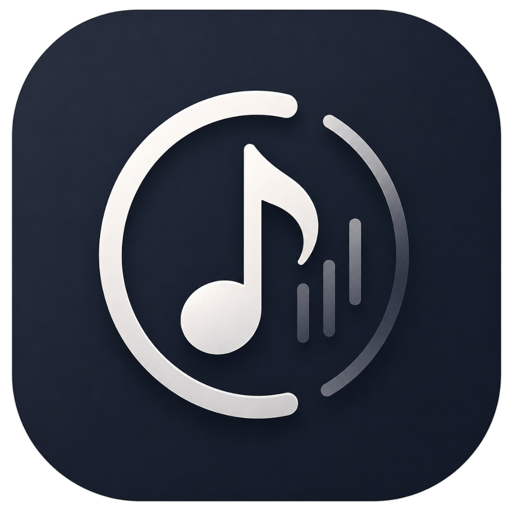
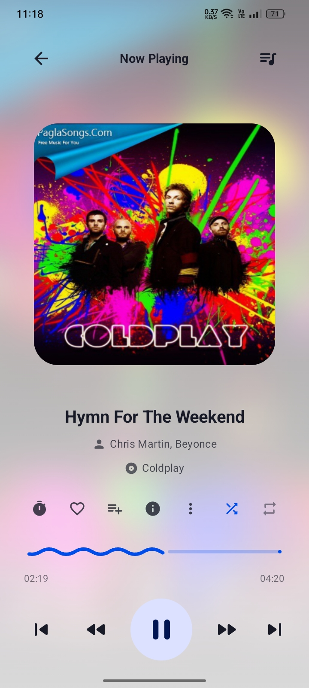
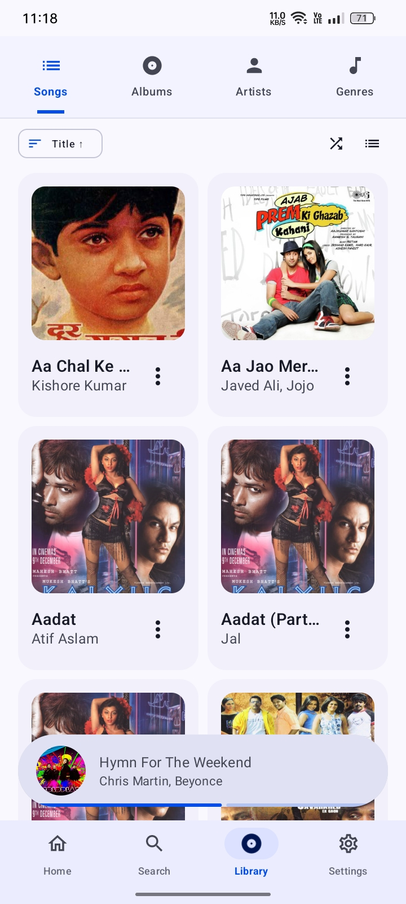
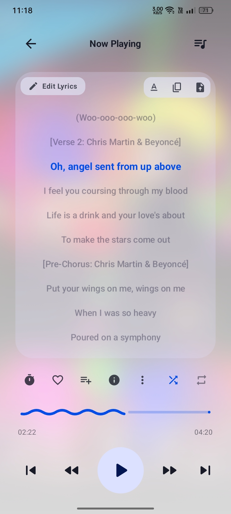
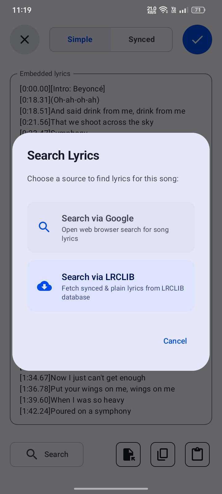
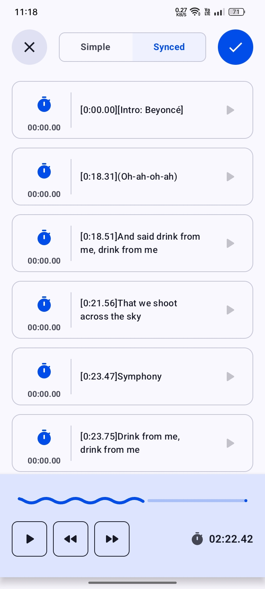
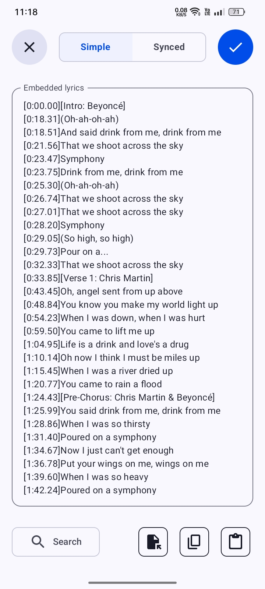
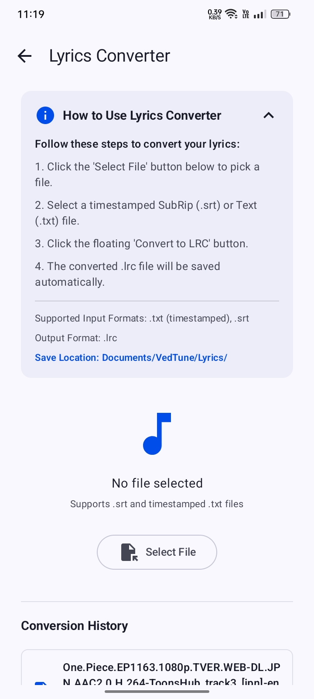
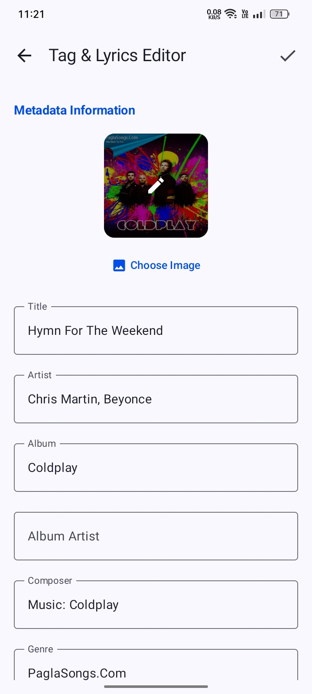

# 🎵 VedTune

<div align="center">



**A powerful, offline-first local music player for Android built with modern Android development standards.**
[](https://github.com/DevSon1024/VedTune/releases)
[](https://kotlinlang.org/)
[](https://developer.android.com/jetpack/compose)
[](https://developer.android.com/media/media3)
[](LICENSE)

---

</div>

## 📱 Screenshots & App Preview

<div align="center">

|                               Player Screen                               |                              Songs Library                              |                              Lyrics Panel                               |                               Lyrics Finder                               |
| :-----------------------------------------------------------------------: | :---------------------------------------------------------------------: | :---------------------------------------------------------------------: | :-----------------------------------------------------------------------: |
|  |  |  |  |

|                               Lyrics Syncer                               |                               Lyrics Editor                               |                                Lyrics Converter                                 |                              Tag Editor                               |
| :-----------------------------------------------------------------------: | :-----------------------------------------------------------------------: | :-----------------------------------------------------------------------------: | :-------------------------------------------------------------------: |
|  |  |  |  |

</div>

---

## ✨ Features

### 🎧 Core Playback & Audio Engine

- **Media3 / ExoPlayer Engine**: Seamless gapless audio playback with MediaSession background service integration and lock screen controls.
- **Transparent Audio Pipeline**: Bit-perfect offline audio reproduction directly from Media3/ExoPlayer decoder with zero unwanted DSP compression, dynamic limiting, or artificial coloration.
- **Queue & Playback Persistence**: Remembers queue state, shuffle/repeat modes, and active position across app restarts.

### 🎙️ Complete Lyrics Suite

- **Synchronized Lyrics**: Millisecond-accurate LRC lyrics display with smooth auto-scroll and dynamic lead compensation.
- **Interactive Lyrics Syncer**: Tap-to-sync tool to easily align raw text lyrics with audio timestamps in real time.
- **LRC Editor & Converter**: Built-in editor to manually modify LRC files and convert between lyric formats.
- **Lyrics Finder**: Fast search tool to locate and attach local or online lyrics to your music library.

### 📁 MediaStore-First Library & Tagging

- **MediaStore Source of Truth**: Non-blocking audio synchronization engine with debounced change detection.
- **Scoped Storage ID3 Tag Editor**: Safely edit title, artist, album, genre, year, composer, lyricist, and track numbers using temporary cached file buffers to prevent corruption on Scoped Storage.
- **Audio Inspector**: Detailed bottom sheet displaying play counts, last played timestamps, and deep technical specs (bitrate, sample rate, encoding, channels, file size) via `jaudiotagger`.

### 🎨 Modern UI & Customization

- **100% Jetpack Compose & Material 3**: Sleek dark mode, fluid micro-interactions, responsive touch targets, and stateless composables.
- **Categorized Settings**: Dedicated sub-screens for **Appearance & Theme**, **Playback Preferences**, and **Library & Folders**.

---

## 🛠️ Tech Stack & Architecture

- **Language**: Kotlin 2.0+
- **Architecture**: MVVM + Clean Architecture principles
- **UI Framework**: Jetpack Compose + Material Design 3
- **Dependency Injection**: Hilt (Dagger)
- **Database & Preferences**: Room Database & DataStore Preferences
- **Audio Engine**: AndroidX Media3 ExoPlayer & MediaSession
- **Metadata Processing**: jaudiotagger
- **Image Loading**: Coil

---

## 🏗️ Project Structure

```
com.devson.vedtune/
├── data/           # Repositories, MediaStore sync engine, Room DB, entities
├── player/         # Media3 service, playback connection, transparent audio pipeline
├── ui/             # Jetpack Compose screens, components, theme & navigation
│   ├── components/ # Reusable composable controls & bottom sheets
│   ├── lyrics/     # Lyrics panel, syncer, editor, finder & converter screens
│   ├── player/     # Main playback screen & controls
│   ├── screens/    # Songs, Albums, Artists, Playlists & Folders screens
│   └── settings/   # Appearance, Playback & Library settings sub-screens
└── di/             # Hilt modules (AppModule, DatabaseModule, ServiceModule)
```

---

## 🚀 Building & Getting Started

### Prerequisites

- Android Studio Ladybug or newer
- JDK 17
- Android SDK 36 (Min SDK 26)

### Clone & Build

```bash
git clone https://github.com/DevSon1024/VedTune.git
cd VedTune
./gradlew assembleDebug
```

---

## 🤝 Credits & Inspirations

- **[Musicolet](https://krosbits.in/musicolet/)** - For structural inspiration, offline-first philosophy, and deep offline library feature sets.
- **[jaudiotagger](http://www.jthink.net/jaudiotagger/)** - For robust ID3 tag reading and metadata extraction.
- **[lrclib](https://github.com/tranxuanthang/lrclib)** - for lyrics handling implementation
- **AndroidX Media3 Team** - For the ExoPlayer and MediaSession backend.

---

<div align="center">
Developed with ❤️ by <b>Devson</b>
</div>
